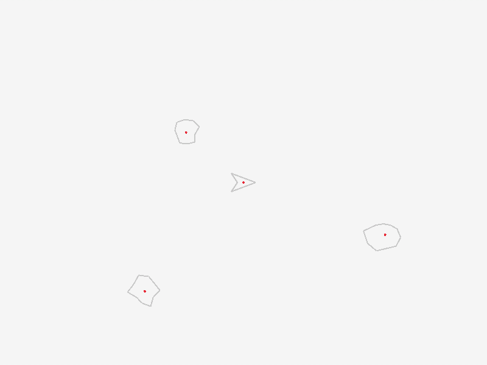

# cl-asteroids
Common Lisp Asteroids Clone

## What is this?
* the idea in this repo was to create a simple asteroids game clone (based on an example from the tic-80 fantasy computer community)
* this was based on my own [cl-game-spell](https://github.com/drigoor/cl-game-spell)
* it is using [raylib](https://www.raylib.com) for drawing and input

### Screenshots




# Installing and running (in *Windows*)

## in *PowerShell*

* install [sccop](https://scoop.sh)

```text
follow the instructions in the page (tip: install at c:\home\scoop)
```

* install [sbcl](http://www.sbcl.org)

```powershell
scoop install sbcl
```

* install [msys2](https://www.msys2.org)

```powershell
scoop install msys2
```

## in *MinGW64* shell

* install tools

```bash
pacman -Syu
pacman -Su
pacman -S git
pacman -S --needed base-devel mingw-w64-x86_64-toolchain
pacman -S mingw-w64-x86_64-libffi
pacman -S mingw-w64-x86_64-emacs
```

* libffi (copy and rename)

```text
copy C:\home\scoop\apps\msys2\current\mingw64\bin\libffi-8.dll -> C:\home\scoop\apps\sbcl\current\libffi.dll
```

* install [raylib](https://www.raylib.com)

```bash
pacman -S mingw-w64-x86_64-raylib
```

* install [raygui](https://github.com/raysan5/raygui) [^1][^2]

```bash
cd home\bin
git clone https://github.com/raysan5/raygui.git
cd raygui
mv src/raygui.h src/raygui.c
gcc -o src/raygui.dll src/raygui.c -shared -DRAYGUI_IMPLEMENTATION -DBUILD_LIBTYPE_SHARED -static-libgcc -lraylib -lopengl32 -lgdi32 -lwinmm -Wl,--out-implib,src/librayguidll.a [^1]
cp C:\home\bin\raygui\src\raylib.dll -> C:\home\scoop\apps\sbcl\current\libraygui.dll
```

[^1]: in the command *gcc* it was required to added '*-lraylib*' so the linker work (not in the official documentation)

[^2]: also, in the *raylib.c* file it was required to move the function *GetCodepointNext* before its use in the function *GuiTextBox*

## etc

* install [quicklisp](https://www.quicklisp.org/beta/)

```text
follow the instructions in the page
```

* ensure that the project is available in the *quicklisp local-projects* (use a *dos* *cmd* window):

```bat
mklink /J c:\home\quicklisp\local-projects\cl-asteroids c:\home\projects\lisp\cl-asteroids
```

* install [claylib](https://github.com/defun-games/claylib)

```text
just git clone the claylib directly to c:\home\quicklisp\local-projects
```

* Running...[^end]

Run emacs from *MinGW64* shell:

```bash
emacs &
```

In Emacs (with [sly](https://github.com/joaotavora/sly)[^slime] installed) do:

```text
M-x sly
```

Now in the repl do:

```cl
(ql:quickload :cl-asteroids)
(asteroids:run)
```

[^slime] could also use [slime](https://github.com/slime/slime) instead of sly

[^end] in the end we can delete the raygui *c:\home\bin\raygui\src*

[^tests] to test, in the lisp repl we can do *(ql:quickload :claylib/examples)* and after *(claylib/examples/basic-window:main)*
