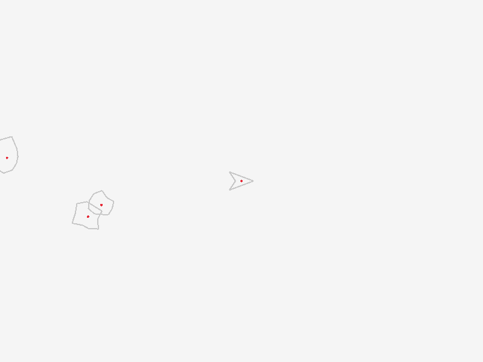

# cl-asteroids
Common Lisp Asteroids Clone

## Installation and loading

```bat
mklink /J c:\home\quicklisp\local-projects\cl-asteroids c:\home\projects\cl-asteroids
```

## What is this?
* the idea in this repo was to create a simple asteroids game clone (based on an example from the tic-80 fantasy computer community)
* this was based on my own [cl-game-spell](https://github.com/drigoor/cl-game-spell)
* it is using [raylib](https://www.raylib.com) for drawing and input

### Screenshots




### Instructions

* run in mingw64 shell


FOR RUNNING RAYLIB
------------------

* copy the following .dll to sbcl folder
  - raylib.dll
  - libffi-7.dll	<- this one from msys2


FOR RUNNING SDL2
----------------

* install msys2

pacman -Syu
pacman -Su
pacman -S git
pacman -S --needed base-devel mingw-w64-x86_64-toolchain
pacman -S mingw-w64-x86_64-libffi
pacman -S mingw-w64-x86_64-emacs
pacman -S mingw-w64-x86_64-SDL2
pacman -S mingw-w64-x86_64-SDL2_ttf
pacman -S mingw-w64-x86_64-SDL2_image


--- others not installed ---
mingw-w64-x86_64-SDL2_gfx
mingw-w64-x86_64-SDL2_mixer
mingw-w64-x86_64-SDL2_net
mingw-w64-x86_64-smpeg2
